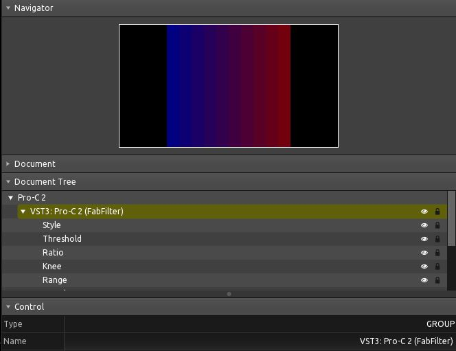

Reaper to Touch OSC
----------------------

This asks REAPER to execute a few scripts via Web Interface. The result is a .tosc file generated from the FX Params of the Last Touched FX.

1. Install Reaper, Reapack and SWS Extensions.
2. Import this repository to your Reapack:

.. code-block::

    https://raw.githubusercontent.com/AlbertoV5/ReaperTools/master/index.xml

3. Install all LISZT scripts from AlbertoV5-ReaperTools.
4. Setup Python in Reaper* and install dependencies.

.. code-block::
    
    tosclib>=0.1.9
    aiohttp==3.8.1

5. Setup Reaper Web Interface.**
6. Load up an FX (JSFX not supported yet :/ ) and run this script.

.. literalinclude:: 5-reaper-tosclib.py
    :language: python

The result will be a template with Faders named as the FX Parameters with OSC messages named after them:

Feel free to make your own version of liszt-generate.py to fit your needs.

Here is more info on how to set up stuff:

**\*Set up Python in Reaper:**

.. code-block::

    $ where python

Avoid using Anaconda environments in Windows as they have issues with Reaper. Set the path here:

.. image:: ../images/reaper_python.JPG

**\*\*Web Interface settings:**

The only thing you need is the port. If you are running this script from another local machine then change the host to the Reaper machine IP or use the Access URL.

.. image:: ../images/reaper_www_settings.JPG
